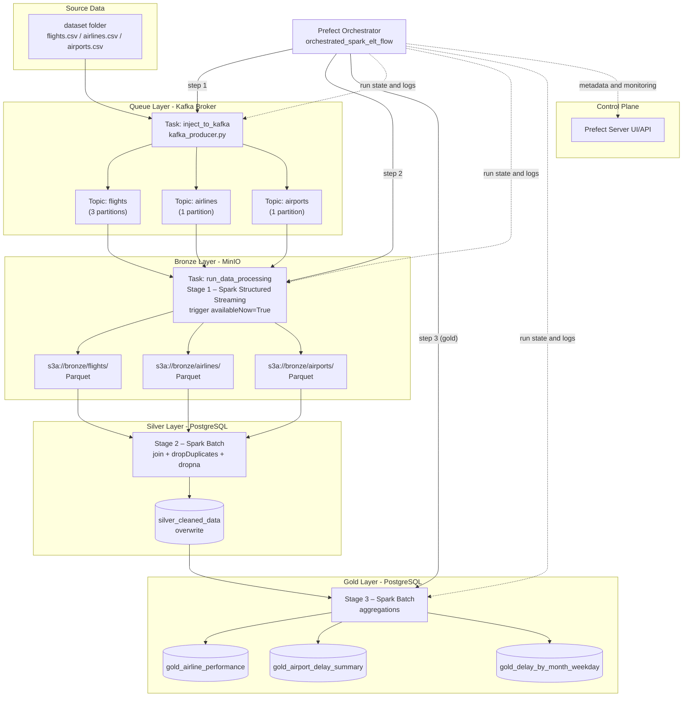

# Orchestrated Spark ELT - Pipeline Architecture

Prefect orchestrates three tasks sequentially. CSV source files are ingested automatically into Kafka topics by a producer task, then Spark Structured Streaming lands the raw events in MinIO Bronze, a Spark batch job joins and cleans the data into PostgreSQL Silver, and finally a second Spark batch job computes analytical aggregations in the Gold layer.

