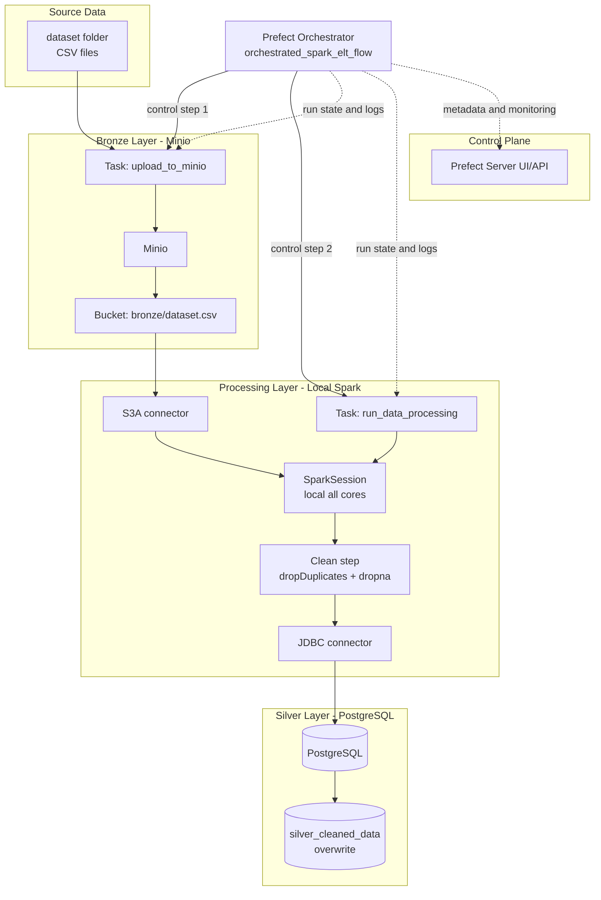

# Orchestrated Spark ELT - Pipeline Architecture

This diagram highlights Prefect as the central orchestrator controlling both tasks and monitoring run state.

Edit/preview link: https://l.mermaid.ai/gMZV0y
